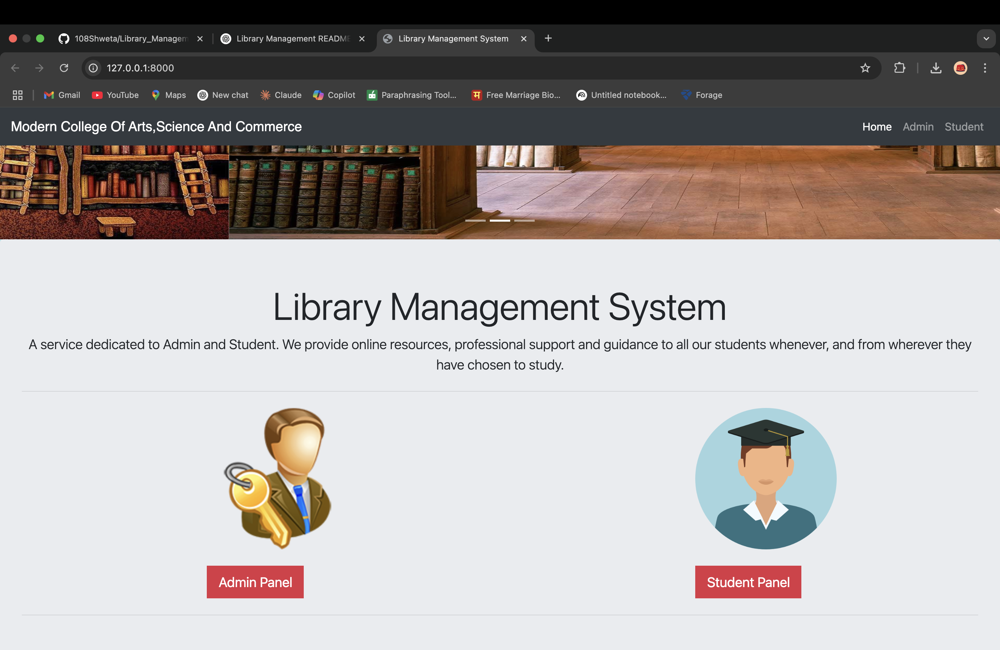

# 📚 Library Management System

A web-based Library Management System built using **Python**, **Django**, **HTML**, and **CSS**. This project helps manage book issuing, user registration/login, and book records efficiently for libraries or educational institutions.

## 🚀 Features

- ✅ User Registration & Login (Authentication)
- 📖 View All Books
- 📕 Issue Book Functionality
- 🔍 Search Books
- 👤 Admin Dashboard (Optional, if implemented)
- 📑 View Issued Books
- 🔐 Session-based User Authentication


## 🖼️ Screenshots

### 🔐 Login Page


### 🏠 Dashboard


## 🛠️ Technologies Used

- **Backend**: Python, Django
- **Frontend**: HTML, CSS
- **Database**: SQLite (Default with Django)
- **Others**: Django Admin Panel, Django Forms, Templates

## 🔧 Setup Instructions

Follow the steps below to run the project locally.

### 1. Clone the Repository

```bash
git clone https://github.com/your-username/library-management-system.git
cd library-management-system
```

### 2. Create Virtual Environment (Recommended)

```bash
python -m venv env
source env/bin/activate    # For Linux/macOS
env\Scripts\activate     # For Windows
```

### 3. Install Dependencies

```bash
pip install -r requirements.txt
```

If you don't have a `requirements.txt` file, you can install manually:

```bash
pip install django
```

### 4. Run Migrations

```bash
python manage.py makemigrations
python manage.py migrate
```

### 5. Create Superuser (for admin access)

```bash
python manage.py createsuperuser
```

### 6. Start the Development Server

```bash
python manage.py runserver
```

Now open your browser and visit `http://127.0.0.1:8000/`

## 📁 Project Structure

```
library-management/
├── library/             # Main Django app
│   ├── templates/
│   ├── static/
│   ├── views.py
│   ├── models.py
│   └── urls.py
├── library_management/  # Project settings
│   ├── settings.py
│   ├── urls.py
│   └── wsgi.py
├── db.sqlite3
├── manage.py
└── requirements.txt
```

## 🙋‍♀️ Author

**Shweta Bhaskar Janakwade**  
🎓 MBA IT | Python & Django Developer  
📫 [Your LinkedIn or Email here] (optional)

## 📃 License

This project is licensed under the [MIT License](LICENSE).

## ⭐️ GitHub Repository

If you like this project, please ⭐ the repo to support it!

```bash
https://github.com/your-username/library-management-system
```
